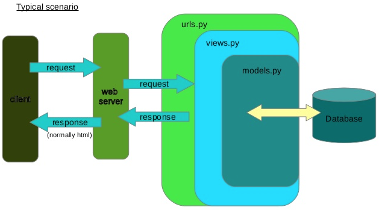

# Django

The reference repository is [:material-github: sannae/djangocrm](https://github.com/sannae/djangocrm).

??? Resources
    * The main Django documentation is available [here](https://docs.djangoproject.com/en/).
    * Another nice learning path is in [:material-microsoft: Microsoft Learn](https://docs.microsoft.com/en-us/learn/paths/django-create-data-driven-websites/) and in the [:material-youtube: Microsoft Developers](https://www.youtube.com/playlist?list=PLlrxD0HtieHjHCQ0JB_RrhbQp_9ccJztr) Youtube channel.

??? Tutorials
    * [:material-youtube: Create a CRM web app](https://youtube.com/playlist?list=PL-51WBLyFTg2vW-_6XBoUpE7vpmoR3ztO) by Dennis Ivy
    * [:material-youtube: Create an expense tracking web app](https://youtube.com/playlist?list=PLx-q4INfd95G-wrEjKDAcTB1K-8n1sIiz)
    * [:material-youtube: Django tutorial](https://youtube.com/playlist?list=PL1WVjBsN-_NIdlnACz0Mxuq8VcuxER-is)
    * [:material-youtube: Django Testing](https://youtube.com/playlist?list=PLbpAWbHbi5rMF2j5n6imm0enrSD9eQUaM)
    * [:material-youtube: Django Testing Automation with GitHub Actions](https://youtube.com/playlist?list=PLOLrQ9Pn6caxeUIXRVOZpDJ_2PbGAa_Io) by VeryAcademy
    * [:material-youtube: Django and Docker](https://youtube.com/playlist?list=PLOLrQ9Pn6cazCfL7v4CdaykNoWMQymM_C) by VeryAcademy

## Requirements

* [Python](https://www.python.org/downloads/) (`python3 -V` on Linux, `python -V` on Windows)
* [Django](https://www.djangoproject.com/download/), check if it's installed with a simple `python -m django --version`

All the required Python packages are listed in `requirements.txt` (to be updatable with `pip freeze > requirements.txt`), run `pip install -r requirements.txt` to load them in your environment.

<a name="pip-freeze-warning">:warning:</a> **Always** run `pip freeze` from a virtual environment! Or it will just go on filling with c**p when deploying from any Cloud platform.

## Random notes

### About Django's architecture and MVT pattern

#### Create a project

* A **Django project** is "A Python package – i.e. a directory of code – that contains all the settings for an instance of Django. This would include database configuration, Django-specific options and application-specific settings." ([source](https://docs.djangoproject.com/en/3.2/glossary/#term-project) and [tutorial](https://docs.djangoproject.com/en/3.2/intro/tutorial01/#creating-a-project))
* To get started with a project:
    * Create a folder for your project: `mkdir PROJECT_NAME`:
    * Move in your project folder: `cd PROJECT_NAME`
    * Remember to activate your [virtual environment](./../langs/python.md): `python3 -m venv venv` and `source venv/bin/activate`
    * Install the dependencies (`python3 -m pip install django`) and freeze them in a file (`python3 -m pip freeze > requirements.txt`)
    * Create the core of the project: `django startproject core .`
    * The command `startproject` will create the following folder structure in your project folder:
    ```
    manage.py           # django command-line utility (check "python manage.py --help")
    core/           # main project folder
        __init__.py         # empty file telling Python that this directory should be considered a package
        settings.py         # all of your settings or configurations
        urls.py             # URLs within the project
        asgi.py             # entry point for your web servers if asgi server is deployed
        wsgi.py             # entry point for your web servers if wsgi server is deployed
    ``` 

#### Create an app

* Within the project, there may be several *apps*: each app structure is created in your project folder with `py -m django startapp APPLICATION_NAME` (from the same directory as `manage.py`)
    * The app has the following structure:
    ```
    APPLICATION_NAME/           # main app folder
        __init__.py         # empty file telling Python that this directory should be considered a package   
        admin.py            # file used to register admin templates
        apps.py             # list of apps
        migrations/         # list of migrations
            __init__.py         # empty file telling Python that this directory should be considered a package 
        models.py           # models of the app
        tests.py            # tests included in the app, see the corresponding section
        views.py            # views of the app
    ```
    * Add the `APPLICATION_NAME\urls.py` to map the routes in your application, with the following default content to create the home path:
    ```python
    from django.urls import path
    from . import views

    urlpatterns = [
    path('', views.index, name='index'),
    ]
    ```
    * The path management must also be handled by the main `PROJECT_NAME\urls.py` file, where you should add at the beginning:
    ```python
    from django.urls import include, path
    ```
    and in the `urlpatterns` list (replacing `APPLICATION_NAME`):
    ```python
    path('', include('APPLICATION_NAME.urls')),
    ```
    * Register the application in the `PROJECT_NAME\apps.py` file and to add it to the `INSTALLED_APPS` list in `settings.py` or the project won't be able to load it when running!
    * Add the following test content in `APPLICATION_NAME\views.py`:
    ```python
    from django.shortcuts import render
    from django.http import HttpResponse

    def index(request):
        return HttpResponse("Hello, world!")
    ```
* The live web server is started with `py -m django manage runserver` and is reachable at <http://localhost:8000>

#### Misc.

* Django follows the MVC architecture (Model-View-Controller), although it uses a non-idiomatic way of naming its parts:  
```
Idiomatic term | Django term | Meaning
Model          | Model       | Contains all the business logic. At the very least the database access logicView           | Template    | Responsible for generating the HTML and other UI
Controller     | View        | Contains the logic to tie the other parts together and to generate a response to a user request
```
A schematic view is available below:

* Oversimplifying, to add a feature you
  1) Update the model in `models.py` (if needed)
  2) Create or update the corresponding view in `views.py`
  3) If the new feature opens a new page, create the new html page in `templates/` and add it to `urls.py`
* General application secrets (i.e. database user, database password, secret key, etc.) are decoupled from the application with a JSON file not tracked by Git and using the `get_secret` function in `settings.py`. The function is:
```python
# Secrets
with open(os.path.join(BASE_DIR, 'secrets.json')) as secrets_file:
    secrets = json.load(secrets_file)

def get_secret(setting, secrets=secrets):
    """Get secret setting or fail with ImproperlyConfigured"""
    try:
        return secrets[setting]
    except KeyError:
        raise ImproperlyConfigured("Set the {} setting".format(setting))
```
Then create your git-untracked `secrets.json` file with the following structure:
```json
{
    "SECRET_KEY" : "YOUR_SECRET_KEY",
    "DB_USER": "YOUR_DB_USER",
    "DB_PASSWORD": "YOUR_DB_PASSWORD",
    ...
}
```
So that you can call your secrets from within the rest of the app by using:
```python
SECRET_KEY = get_secret('SECRET_KEY')
```
* In the admin site, the display shows the **name** of the `Customer` or the `Product` for the registered models. This information appears because we set the `__str__` method on our objects. The default display of any object is the value returned by `__str__`.

### About templates

* Django is embedded in HTML via [template tags](https://docs.djangoproject.com/en/3.2/ref/templates/builtins/)
* The views of the app call the templates saved in `APPLICATION_NAME/templates/APPLICATION_NAME` (according to a Django's convention)
* The templates use a combination of HTML/CSS/JS and Django's `` syntax: this lets you modularize the code
    * Template tags can also be used to create the usual blocks to be run inside the template:
        * if/else statements:
        ```html
        
            <h3>There are {{ somethings.length }} things</h3>
        
            <h3>Nothing here!</h3>
        
        ```
        * for loops:
        ```html
        <ul>
        
            <li>{{ thing.name}}</li>
        
        </ul>
        ```

* The variables in the templates are called like in the corresponding views and rendered with the field `{{ variable }}`
    * They can even be piped to a specific function or filter within the double curly braces, like in `{{ variable.field | function }}`
* The HTML/CSS/JS templates use [:material-bootstrap: Bootstrap](https://getbootstrap.com/docs/5.1/getting-started/introduction/)
* :warning: Do _not_ comment Django template tags with usual HTML comments, as described [:material-stack-overflow: in this Stack Overflow post](https://stackoverflow.com/questions/62793267/reverse-for-create-order-with-no-arguments-not-found)!! 
```html
<!-- this is the usual HTML comment -->
<!--  -->
<!-- {#% This is a commented Django tag %#} -->
```

<!-- ********************************* TO BE COMPLETED

* The  tag
* [Template inheritance]()
Parent page
Child page
Default values
Django's ORM caching
**************************************** -->

### About models

* In your `models.py` file, you can add a first test model like:
```python
class MODEL_NAME(models.Model):
    pass
```


* In using the `ForeignKey` relationship between a 'parent' field and a 'child' field in `models.py`, Django automatically adds a property to the parent to provide access to all children called `<child>_set`, where `<child>` is the name of the child object. Below an example:
```python
from django.db import models
class Product(models.Model):
    name = models.TextField()
    category = models.ForeignKey(
        'Category', #The name of the model
        on_delete=models.PROTECT
    )

class Category(models.Model):
    name = models.TextField()
    # product_set will be automatically created
```

### About static files

* To upload the static files into an [AWS S3 bucket](./../cloud/aws.md), check out the documentation of [django-storages](https://django-storages.readthedocs.io/en/latest/). You basically need the `django-storages` and `boto3` Python libraries, as well as the following additional settings in `settings.py`:
```python
AWS_ACCESS_KEY_ID = get_secret('AWS_ACCESS_KEY_ID')
AWS_SECRET_ACCESS_KEY = get_secret('AWS_SECRET_ACCESS_KEY')
AWS_STORAGE_BUCKET_NAME = get_secret('AWS_STORAGE_BUCKET_NAME')
AWS_S3_HOST = 's3.eu-west-3.amazonaws.com'
AWS_S3_REGION_NAME = 'eu-west-3'
AWS_S3_FILE_OVERWRITE = False
AWS_DEFAULT_ACL = None
DEFAULT_FILE_STORAGE = 'storages.backends.s3boto3.S3Boto3Storage'
STATICFILES_STORAGE = 'storages.backends.s3boto3.S3Boto3Storage'
```
Here's a [nice tutorial on creating a Django project with static files on AWS S3](https://testdriven.io/blog/storing-django-static-and-media-files-on-amazon-s3/) and Docker Compose. [This one also](https://www.caktusgroup.com/blog/2014/11/10/Using-Amazon-S3-to-store-your-Django-sites-static-and-media-files/#s3-bucket-access) is a _very_ good article.

### About user authentication
* Django comes with a built-in user management and authentication system, where you can manage: 
  * Simple users (`user`), unable to access the admin site
  * Staff users (`staff`), i.e. accessing the admin site but unable to change Data
  * superusers: you can create one with `python manage.py createsuperuser`

* To restrict the user's login, add the `@login_required(login_url='login')` decorator from `django.contrib.auth.decorators` above any restricted view in `views.py` [**manual method**]
* Likewise, you don't want any logged-in user to be able to access the `'login'` or the `'register'` page: add the `if request.user.is_authenticated` in those views to handle it [ **manual method** ]
* Decorators can be listed in a dedicated `\APPLICATION_NAME\decorators.py` file. A **decorator** is a function that takes another function as a parameter. Decorators are called with the `@` symbol
* Adding a property to a user: check [this documentation](https://docs.djangoproject.com/en/dev/topics/auth/customizing/#extending-the-existing-user-model)

### Sending emails (e.g. to reset the user's password)

* The main settings are saved in the `settings.py` file under the `EMAIL_` parameters
* In our example, Gmail was used as the SMTP host; any external login attempt would be blocked by default by Gmail unless you allow "less secure apps" access ([here](https://myaccount.google.com/lesssecureapps)'s the link). BTW it doesn't work directly with MFA accounts, where you'd need a specific [App password](https://support.google.com/accounts/answer/185833?hl=en).
* The `urls.py` must met specific criteria: use the predefined [Authentication Views](https://docs.djangoproject.com/en/3.2/topics/auth/default/#module-django.contrib.auth.views) from `django.contrib.auth` and remember to use the corresponding URLs' names
* If you want to customize all the pre-built forms used by Django's Authentication Views, you can find the templates' names within their [definitions](https://github.com/django/django/blob/master/django/contrib/auth/views.py). Override the default in your `urls.py` by specifying `.as_view(template_name="accounts/TEMPLATE_NAME.html")` in the URL line

### About database and relationships

* To initiate the database, run `py -m manage migrate`: the database's settings are in `SETTINGS.py` and SQLite3 is the default.
* To run progressive migrations, edit your models then run `py -m manage makemigrations` to create your migration files (preparation files before actual migration) in `/APPLICATION_NAME/migrations/`. Remember to register your models in the _admin_ panel to see them.
> The `makemigrations` command uses the current list of migrations to get a starting point, and then uses the current state of your models to determine the delta (the changes that need to be made). It then generates the necessary code to update the database. 
* To view the SQL commands related to a specific migration, run `python manage.py sqlmigrate APPLICATION_NAME MIGRATION_NAME`
* To list the migrations, `python manage.py showmigrations`
* To retrieve data from the db, use [this reference guide](https://docs.djangoproject.com/en/2.2/ref/models/querysets):
  1) Open your Django shell (`py -m manage shell`)
  2) Import all your models (`from APPLICATION_NAME.models import *`)
  3) Specific tables are then available as objects with `TABLENAME.objects.all()` and other methods. 
     1) Example: to retrieve all the customers saved with the `Customer` method, run `Customer.objects.all()`
     2) Example: to retrieve all the customers with a specific name, run `Customer.objects.all().filter(name="YOURNAME")`
* For foreign keys, you can use the `_set` property of the parent object:
```python
Product.customer_set.all()
```
* Example of `INSERT` from `python manage.py shell`:
```python
first_customer = Customer(
  name="Mary Ann", 
  location="USA",
  ...)
first_customer.save()
```
or
```python
Product(name="Shoes", customer=first_customer).save()
```
* A function to specifically create random orders was implemented in the `management\commands\populate-db.py` function, inspired by [this article](https://testdriven.io/blog/django-charts/).

#### Postgresql

* After first testing, migrate the db from SQLite to PostgreSQL using [these instructions](https://medium.com/djangotube/django-sqlite-to-postgresql-database-migration-e3c1f76711e1).


## Tests

* Check out the [Django documentation about testing tools!](https://docs.djangoproject.com/en/3.2/topics/testing/tools/)
* To get started with testing, create a folder `APPLICATION_NAME\Tests` containing all your `test_WHATEVER.py` files, where WHATEVER includes models, views, forms, etc.
    * In this case you will have to delete the `APPLICATION_NAME\tests.py` file, originally created with the app
    * Remember to create the `__init__.py` file in the `Tests/` folder! Or the tests contained in it won't be found by the Django integrated test runner
* To make Django go through the tests, just run `python3 -m manage test APPLICATION_NAME`: Django will recursively look for all the classes and functions whose name starts with `test*`
* In any test, the `assert` statement is the one being tested: a failing test will return `AssertionError`
* Assertions are part of the `SimpleTestCase` class, containing the most simple unit tests (like testing HTML responses, comparing URLs, verifying HTTP redirect, testing form fields, etc.)

## Deployment

* Before deploying, remember to:
    * Turn `Debug = FALSE` in `settings.py`
    * Add the remote host to the `ALLOWED_HOSTS` in `settings.py`, like
```
ALLOWED_HOSTS = [
    get_secret('HEROKU_HOST'),      # For production purposes (Debug=FALSE)
    "127.0.0.1"                     # For testing purposes (Debug=TRUE)
    ]
```

### Deploy on [Heroku](https://www.heroku.com/)

Your project needs the [Gunicorn](https://gunicorn.org/) and [Whitenoise](http://whitenoise.evans.io/en/stable/) pip modules installed

* After logging in (`heroku login -i`), connect to your Heroku app using the Heroku CLI an running `heroku git:remote --app=HEROKU_APP_NAME` to add a remote origin to your Git tracking in the project
* Add a [`procfile`](https://devcenter.heroku.com/articles/procfile) (no extension!) to your project: it's needed by Heroku to specify a process type. Inside of it, just type `web: gunicorn YOUR_APP_WSGI_NAME.wsgi --log-file -`
* Remember to specific a _build pack_ (i.e. Python) in your Heroku app settings
* In the manual deploy from the Heroku app page, you may need to remove some specific requirements' versions (as described in [:material-stack-overflow: this post](https://stackoverflow.com/questions/47304291/heroku-upload-could-not-find-a-version-that-satisfies-the-requirement-anaconda/56754565)) from `requirements.txt` (but first, remember to [check this](#pip-freeze-warning)!)
* Heroku doesn't know how to serve static files, so it is better to install [Whitenoise](http://whitenoise.evans.io/en/stable/) and use it in the `MIDDLEWARE` section of your `settings.py` file

### Deploy on [:material-docker: Docker](https://www.docker.com/)

* Write your Dockerfile: the base image is the [official Python Docker image](https://hub.docker.com/_/python) as the Django image is deprecated. The application directory is copied in the workdir `/usr/src/app` and the requirements are installed using the `requirements.txt` file. Lastly, the `manage runserver` command is executed to start the web server.
```dockerfile
# Base image
FROM python

# Working directory
WORKDIR /usr/src/app

# Install dependencies
COPY requirements.txt ./
RUN pip install --upgrade pip
RUN pip install --no-cache-dir -r requirements.txt

# Copy the whole app folder
COPY . .

# Run web server
CMD [ "python", "manage.py", "runserver", "0.0.0.0:8000" ]
```
* Build the image using `docker build -t my-django-image .` from the path of the Dockerfile (it may require a few minutes 🕰)
* Start the container with `docker run --name my-django-cont -d -p 8000:8000 my-django-image`
* Verify that your container has been created with `docker ps -a`
* Open your web application on a browser with <http://HOSTNAME:8000> where `HOSTNAME` is included in the `ALLOWED_HOSTS` list in `settings.py` 
* [optional] Interact with your container with `docker exec -it my-django-cont bash`

!!! info "Clean your environment"
    * docker stop my-django-cont
    * docker rm my-django-cont
    * docker image rm my-django-image 
    * docker image rm python

### Deploy on [:material-microsoft-azure: Azure Web Apps](https://docs.microsoft.com/en-us/learn/modules/django-deployment/) 

:warning: TBD

## **Definitely** review

* [Forms](https://docs.djangoproject.com/en/3.2/topics/forms/) and [Formsets](https://docs.djangoproject.com/en/3.2/topics/forms/formsets/)
* Users' authentication and register page
* How to use decorators
